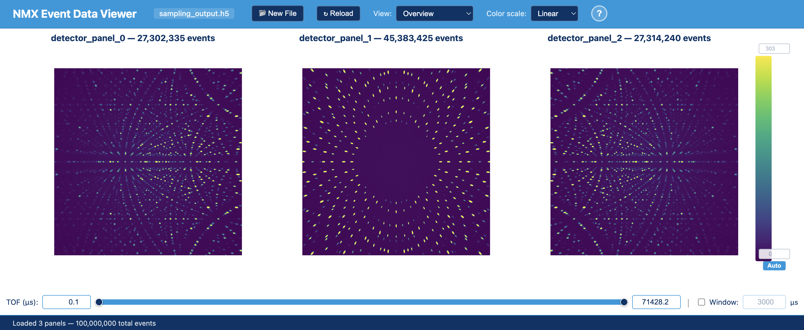
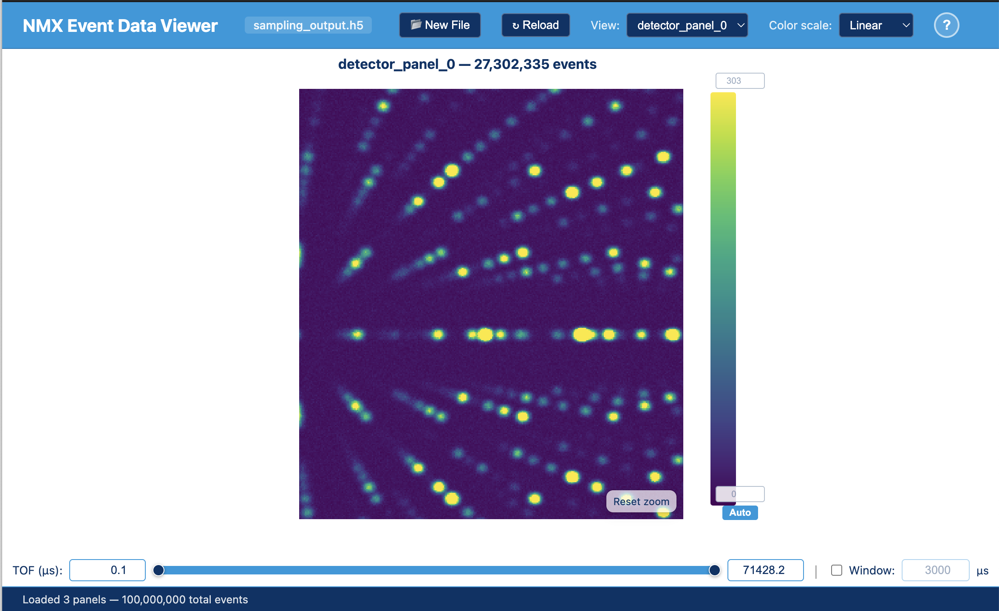
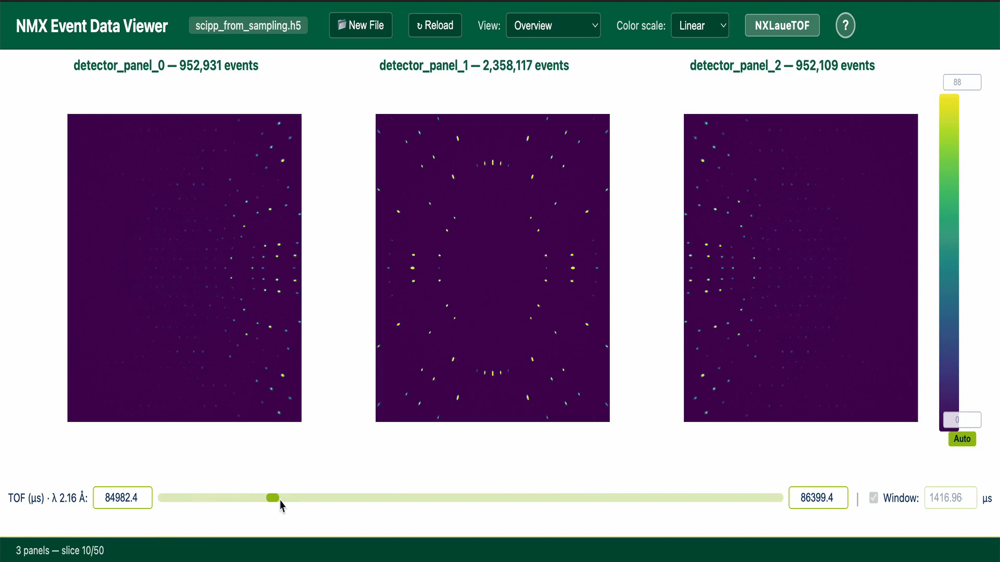

# NMX Viewer

Interactive browser-based viewer for NMX detector data stored in NeXus/HDF5 files.

This app is designed for fast exploration of time-of-flight neutron event data, with support for both raw event streams and pre-binned Laue TOF data.

## Features

- Load local HDF5/NeXus files directly in the browser (no server upload required)
- Auto-detect and handle:
  - `NXevent_data` (raw events)
  - `NXlauetof` (pre-binned TOF slices)
- Multi-panel detector overview and single-panel inspection modes
- Interactive TOF filtering with:
  - min/max range controls
  - draggable selected window
  - keyboard stepping with left/right arrows by current slice width
- Shared color bar with manual min/max and auto-scaling
- Built-in help overlay and drag-and-drop file loading
- Reload workflow for live/SWMR-style updates

## Screenshots

### Overview window


### Single-panel window


### TOF Window Selection



## Getting Started

### Prerequisites

- Node.js 18+
- npm

### Install

```bash
npm install
```

### Run Development Server

```bash
npm run dev
```

Then open the local Vite URL (typically `http://localhost:5173`).

### Build for Production

```bash
npm run build
```

### Preview Production Build

```bash
npm run preview
```

## Usage

1. Start the app and load a `.h5` / `.hdf` / NeXus file.
2. The viewer detects file type and discovers detector panels automatically.
3. Use the TOF controls to filter the event window.
4. Adjust color scaling (Linear, Log, SymLog, Sqrt) and domain limits.
5. Switch between Overview and single-panel modes as needed.

## Keyboard and Mouse Controls

- `H`: Toggle help overlay
- `Esc`: Close help overlay
- `Left` / `Right`: Shift current TOF selection window
- Single panel view:
  - drag to zoom
  - shift + drag to pan

## Project Structure

```text
src/
  components/
    DetectorImage.tsx
    FileLoader.tsx
    TofRangeSlider.tsx
    ViridisColorBar.tsx
  lib/
    event-data.ts
    h5wasm-loader.ts
    dspacing.ts
  App.tsx
```

## Tech Stack

- React + TypeScript
- Vite
- h5wasm / h5wasm-plugins
- h5web visualization components

## Notes

- Large datasets can require noticeable client-side memory and processing time.
- Build output may include a Vite chunk-size warning for the current dependency set.

## License

MIT License